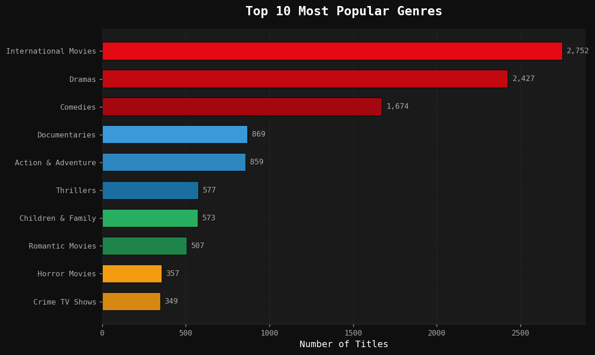
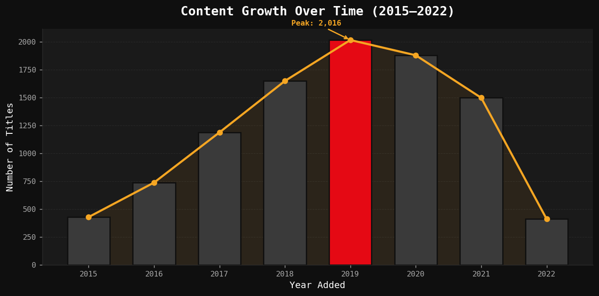

# 🎬 Netflix Data Analysis

> Exploratory Data Analysis on 8,807 Netflix titles — uncovering content strategy patterns, growth trends, and audience targeting insights.

---

## 📸 Preview

| Content Mix | Growth Over Time |
|:-----------:|:----------------:|
|  |  |

> 💡 *Run the notebook to see all 6 interactive visualizations with Netflix's dark theme.*

---

## 🎯 Objective

Analyze Netflix's public catalog dataset to answer:

- What is the balance between **Movies vs TV Shows**?
- How did **content volume grow** over the years?
- Which **countries** produce the most content?
- What **genres** dominate the platform?
- How does **content rating** distribution look?
- What's the typical **movie runtime**?

---

## 📊 Key Findings

| Insight | Finding |
|---------|---------|
| 🎥 Content split | 69.6% Movies · 30.4% TV Shows |
| 📈 Peak growth year | 2019 — 2,016 titles added |
| 🌍 Top producer | United States (32% of catalog) |
| 🎭 Most common genre | International Movies (2,752 titles) |
| 🔞 Most common rating | TV-MA — 36.4% of all content |
| ⏱️ Average movie runtime | ~99 minutes |

---

## 🛠️ Tech Stack


---

## 📁 Project Structure

```
netflix-data-analysis/
│
├── Netflix_Data_Analysis.ipynb   # Main notebook (outputs included)
├── netflix_titles.csv            # Dataset (from Kaggle)
└── README.md
```

---

## 🚀 How to Run

```bash
# 1. Clone the repository
git clone https://github.com/your-username/netflix-data-analysis.git
cd netflix-data-analysis

# 2. Install dependencies
pip install pandas matplotlib seaborn jupyter

# 3. Launch the notebook
jupyter notebook Netflix_Data_Analysis.ipynb
```

---

## 📂 Dataset

**Source:** [Netflix Movies and TV Shows — Kaggle](https://www.kaggle.com/datasets/shivamb/netflix-shows)

| Field | Description |
|-------|-------------|
| `type` | Movie or TV Show |
| `title` | Title name |
| `director` | Director name |
| `cast` | Main cast |
| `country` | Country of production |
| `date_added` | Date added to Netflix |
| `release_year` | Original release year |
| `rating` | Content rating (TV-MA, PG-13, etc.) |
| `duration` | Runtime in minutes / number of seasons |
| `listed_in` | Genre tags |

---

## 📈 Analysis Steps

1. **Data Loading** — Import CSV, inspect shape and null distribution  
2. **Data Cleaning** — Parse dates, fill nulls, split multi-value columns  
3. **Feature Engineering** — Extract year/month added, duration in minutes, season count  
4. **EDA** — Univariate and bivariate analysis across 6 dimensions  
5. **Visualization** — 6 publication-ready charts with custom Netflix dark theme  
6. **Insights** — Business-level interpretation of all findings  

---

## 👤 Author

**Davi** — Data Analysis · Python · Visualization  

---

*Dataset last updated: 2021. Analysis reflects the catalog snapshot available at that time.*
